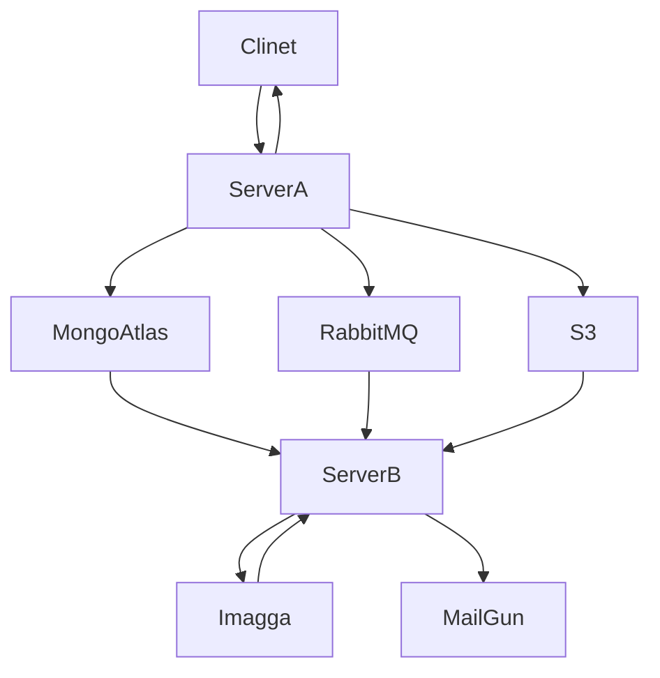
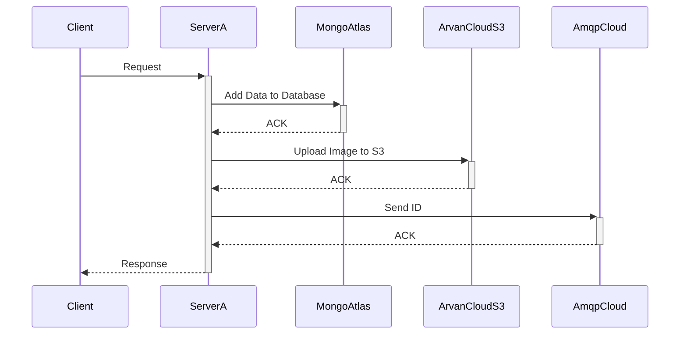

<div align="center">

# Advertisement Registration using Cloud Services

Cloud Computing Course Project

</div>


## Architecture



## Sequence Diagram




## Instructions

### Installing Packages

Run the following command to install needed packages:

```shell
npm i
```

### Adding credential info to project

Create a `src/credentials.js` with this content:

```javascript
const credentials = {
    mongodb: {
        url: '...',
    },
    mailgun: {
        domain: '...',
        apiKey: '...',
    },
    imagga: {
        authorization: '...',
    },
    amqp: {
        url: '...',
        queueKey: '...',
    },
    s3: {
        secretKey: '...',
        accessKey: '...',
        endpointUrl: '...',
        region: '...',
        bucketName: '...',
        bucketContentUrlPrefix: '...',
    },
}

module.exports = credentials;
```

### Starting servers

Following command will start **server A** on port `3001` and **server B** on port `3002` and 
clients will be able to sent their request to server A.

```shell
node src  # running src/index.js
```

### APIs

####  **Check Server A**

 ```
 localhost:3001/
 ```
 

response Example:

```json
{
    "result": "OK",
    "message": "Server A is UP!"
}
```

---

####  **Get List of Advertisements**

 ```
 localhost:3001/ad
 ```

response Example:

```json
{
    "result": "OK",
    "data": [
        {
            "id": 1,
            "description": "a simple description",
            "email": "test@example.com",
            "state": "PENDING",
            "category": "UNKNOWN",
            "image": "..."
        },
        {
            "id": 2,
            "description": "a great red sport car!",
            "email": "example@example.com",
            "state": "APPROVED",
            "category": "sports car",
            "image": "..."
        },
    ]
}
```

---

####  **Get a single Advertisements**

 ```
 localhost:3001/ad/:id
 ```

response Example:

```json
{
    "result": "OK",
    "data": {
        "id": 2,
        "description": "a great red sport car!",
        "email": "example@example.com",
        "state": "APPROVED",
        "category": "sports car",
        "image": "..."
    }
}
```

---

####  **Submiting an Advertisement**

 ```
 localhost:3001/ad
 ```

Body (Form Data):

| Field Name  | Type        |
|-------------|-------------|
| image       | File (.jpg) |
| email       | String      |
| description | String      |

response Example:

```json
{
    "result": "OK",
    "message": "آگهی شما با شناسه‌ی 3 ثبت گردید.",
    "data": {
        "id": 3,
        "description": "a simple description",
        "email": "test@example.com",
        "state": "PENDING",
        "image": "...",
        "category": "UNKNOWN"
    }
}
```

---

####  **Removing an Advertisement**

 ```
 localhost:3001/ad/:id
 ```

response Example:

```json
{
    "result": "OK",
    "data": {
        "acknowledged": true,
        "deletedCount": 1
    }
}
```

---

####   **Removing All Advertisement**

 ```
 localhost:3001/ad
 ```

response Example:

```json
{
    "result": "OK",
    "data": {
        "acknowledged": true,
        "deletedCount": 20
    }
}
```

