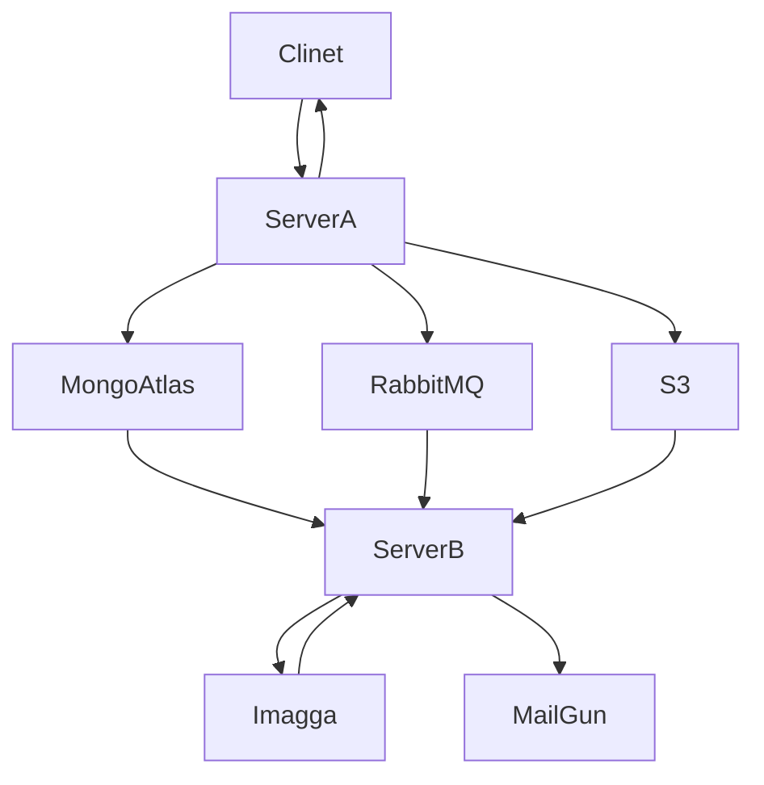

<div align="center">

# Advertisement Registration using Cloud Services

</div>

---

## Architecture




## Developer Notes

Create a `src/credentials.js` with this content:

```javascript
const credentials = {
  mongodb: {
    url: '...',
  },
  mailgun: {
    domain: '...',
    apiKey: '...',
  },
  imagga: {
    authorization: '...',
  },
  amqp: {
    url: '...',
    queueKey: '...',
  },
}

module.exports = credentials;
```
