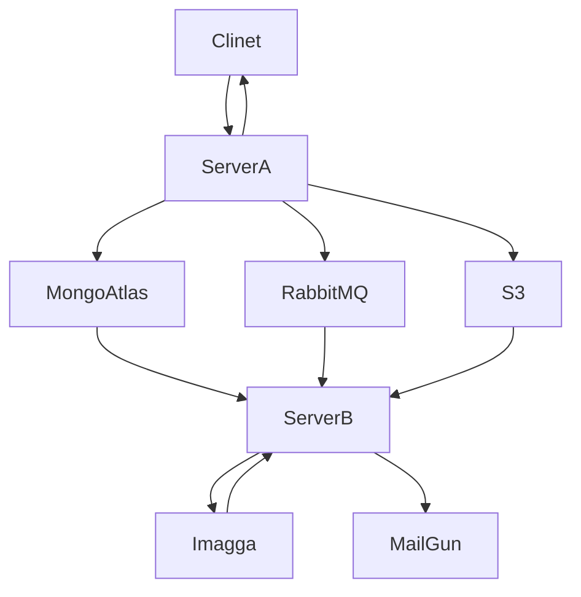

<div align="center">

# Advertisement Registration using Cloud Services

Cloud Computing Course Project

</div>


## Architecture




## Developer Notes

### Installing Packages

Run the following command to install needed packages:

```shell
npm i
```

### Adding credential info to project

Create a `src/credentials.js` with this content:

```javascript
const credentials = {
  mongodb: {
    url: '...',
  },
  mailgun: {
    domain: '...',
    apiKey: '...',
  },
  imagga: {
    authorization: '...',
  },
  amqp: {
    url: '...',
    queueKey: '...',
  },
}

module.exports = credentials;
```

### Starting servers

Following command will start **server A** on port `3001` and **server B** on port `3002` and 
clients will be able to sent their request to server A.

```shell
node src  # running src/index.js
```
